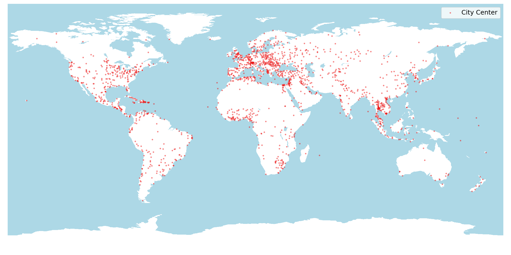

# WorldMove: A global open data for human mobility
<!-- add image -->
<p align="center">
  
</p>
WorldMove is an open access worldwide human mobility dataset, we follow a generative AI-based approach to create a large-scale mobility dataset for cities worldwide. Our method leverages publicly available multi-source data, including population distribution, points of interest (POIs), and synthetic commuting origin-destination flow datasets, to generate realistic city-scale mobility trajectories.

We provides mobility datasets for over 1600 cities spanning 179 countries across 6 continents.

## Model Training and Mobility Trajectory Generation

**step 1**: clone the repository

**step 2**: create a virtual environment with conda or virtualenv

```bash
# with conda
conda create -n move python=3.10
conda activate move
# with virtualenv
virtualenv -p python3.10 move
source move/bin/activate
```

**step 3**: install the dependencies

```bash
pip install -r requirements.txt
```

### Model Training
First, the multi-source location feature data is processed through a location feature encoder, compressing and projecting the regional characteristics into a unified embedding space that enhances model comprehension. Building upon the location embeddings, we leverage real-world human mobility data to encode physical location sequences from different cities into a unified semantic space, forming a comprehensive mobility dataset that encompasses diverse urban mobility patterns. Our diffusion model is then trained on this unified dataset.

**step 1**: train the location feature encoder
```bash
python3 loc_encoder.py --save /path/to/save_dir
```

**step 2**: train the diffusion model

Entrypoint to the diffusion model training is train.py. The script takes a configuration file as input, which specifies the dataset path, hyperparameters, and other settings. The configuration file is in the YAML format, an example is provided in the `configs` directory.

- Modify the configuration file `configs/{city}.yml` to specify the dataset path and other hyperparameters.

- Run the following command to train the diffusion model

```bash
python3 train.py --config configs/{city}.yml --save /path/to/log_dir
```

The trained model will be saved in the log directory and you can check the training process in tensorboard by running `tensorboard --logdir /path/to/log_dir`. We trained our model for 200 epochs on both ISP and MME datasets.

### Mobility Trajectory Generation
We offer a pre-trained model and a pipeline tool for generating mobility datasets for any city worldwide. The pipeline follows a straightforward process:

**step 1**: acquire population data

The population data can be obtained from WorldPop using the script:

```bash
python3 scripts/generate_pop.py --config configs/{city}.yml --save /path/to/pop_dir
```

**step 2**: generate location profiling

Location profiling data can be created by running the script:

```bash
python3 scripts/generate_profile.py --config configs/{city}.yml --save /path/to/pop_dir
```

which integrates data such as population distribution and POI attributes.


**step 3**: generate mobility data

Using the prepared location profiling and population data, mobility data can be generated with the script:

```bash
python3 scripts/generate_mobility --config configs/{city}.yml --save /path/to/pop_dir
```

## Download Pre-generated Mobility Datasets
Check the following link to download the pre-generated mobility datasets for over 1600 cities worldwide:

[WorldMove Dataset Description](https://fi.ee.tsinghua.edu.cn/worldmove/description)

[WorldMove Dataset Download](https://fi.ee.tsinghua.edu.cn/worldmove/data)

## Citation
If you use this code or dataset in your research, please cite our paper:
```bibtex
@article{10.1093/pnasnexus/pgaf081,
    author = {Yuan, Yuan and Ding, Jingtao and Jin, Depeng and Li, Yong},
    title = {Learning the complexity of urban mobility with deep generative network},
    journal = {PNAS Nexus},
    volume = {4},
    number = {5},
    pages = {pgaf081},
    year = {2025},
    month = {05},
    issn = {2752-6542},
    doi = {10.1093/pnasnexus/pgaf081},
    url = {https://doi.org/10.1093/pnasnexus/pgaf081},
    eprint = {https://academic.oup.com/pnasnexus/article-pdf/4/5/pgaf081/63066168/pgaf081.pdf},
}

@inproceedings{10.1145/3696410.3714516,
    author = {Zhang, Yuheng and Yuan, Yuan and Ding, Jingtao and Yuan, Jian and Li, Yong},
    title = {Noise Matters: Diffusion Model-based Urban Mobility Generation with Collaborative Noise Priors},
    year = {2025},
    isbn = {9798400712746},
    publisher = {Association for Computing Machinery},
    address = {New York, NY, USA},
    url = {https://doi.org/10.1145/3696410.3714516},
    doi = {10.1145/3696410.3714516},
    booktitle = {Proceedings of the ACM on Web Conference 2025},
    pages = {5352–5363},
    numpages = {12},
    keywords = {diffusion models, sustainable cities, urban mobility},
    location = {Sydney NSW, Australia},
    series = {WWW '25}
}

@misc{yuan2025worldmoveglobalopendata,
    title={WorldMove, a global open data for human mobility}, 
    author={Yuan Yuan and Yuheng Zhang and Jingtao Ding and Yong Li},
    year={2025},
    eprint={2504.10506},
    archivePrefix={arXiv},
    primaryClass={cs.SI},
    url={https://arxiv.org/abs/2504.10506}, 
}
```